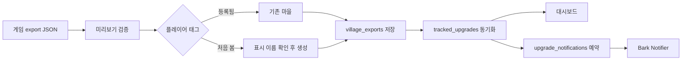

# 마을 데이터 업데이트 흐름

## 목표

일상 작업은 계정 레코드를 편집하는 일이 아니라 게임에서 복사한 JSON을 붙여넣고 내용을 확인하는 일이다. 따라서 설정 화면의 첫 탭은 항상 `붙여넣기 → 자동 검토 → 반영` 흐름을 제공한다. 플레이어 태그와 사용자가 지정하는 계정 그룹 태그는 서로 다른 개념이다.

## 기본 흐름

<!-- contract: DATA-SNAPSHOT-001 -->
<!-- contract: DATA-FORMAT-001 -->

1. 사용자가 상단 `Quick Paste`, Update Data의 클립보드 버튼 또는 입력창으로 게임의 데이터 내보내기 JSON을 붙여넣는다.
2. 클라이언트가 완성된 JSON 문서를 감지하면 짧은 debounce 후 미리보기 API를 호출한다. 입력이 바뀌면 이전 응답은 폐기한다.
3. 서버가 JSON과 플레이어 태그, export 시각, 타이머 범위를 검증한다.
4. 플레이어 태그로 등록된 마을을 자동 식별한다. 사용자가 마을을 선택하지 않는다.
5. 화면에서 마을, 타운홀, export 시각, 빌더, 감지된 업그레이드와 남은 시간을 미리 확인한다.
6. 기존 마을이면 Import 버튼으로 포커스를 옮기고, 사용자가 확인하면 데이터를 반영한다.

진행 중인 업그레이드가 있는 export는 Import 즉시 `unanswered` 상태로 먼저 반영한 뒤 마을 단위 자원 상태를 묻는다. 선택한 응답은 별도로 저장하며, 응답하지 않아도 이미 반영된 export와 `unanswered` 상태를 유지한다. 상세 동작은 [자원 상태 기반 업그레이드 알림 정책](resource-notification-policy.md)에 정의한다.

처음 보는 플레이어 태그라면 미리보기에서 새 마을임을 분명히 표시한다. 이때만 표시 이름(label)을 입력받으며, `마을 추가하고 반영`을 확인해야 계정과 export가 함께 저장된다. 잘못 붙여넣은 JSON이 새 계정을 자동 생성해서는 안 된다.

## 서버 검증

<!-- contract: IMPORT-TAG-001 -->
<!-- contract: IMPORT-VALIDATION-001 -->

- 플레이어 태그가 Supercell 문자 규칙을 만족해야 한다.
- 기존 마을은 export의 플레이어 태그와 정확히 일치해야 한다.
- export 시각은 현재보다 10분 이상 미래일 수 없고 30일보다 오래될 수 없다.
- 이미 저장된 export보다 새로운 데이터만 반영한다.
- 활성 타이머는 유효한 숫자이며 최대 180일 범위여야 한다.
- 레벨과 data ID가 허용 범위를 벗어나면 거부한다.

서버는 `timestamp + timer`로 완료 시각을 계산하고 `clash-of-clans-data` 이름 매핑을 이용해 건물·영웅·펫·연구와 장인기지 항목을 정규화한다.

## 업그레이드 가능 상태

<!-- contract: IMPORT-PARSE-001 -->
<!-- contract: IMPORT-SLOT-001 -->
<!-- contract: IMPORT-SLOT-002 -->
<!-- contract: IMPORT-SLOT-003 -->
<!-- contract: IMPORT-SLOT-004 -->

게임 export를 반영한 마을은 대시보드 카드의 업그레이드 가능 상태 영역에 다음 작업 슬롯을 함께 표시한다.

- 본 마을 장인: 장인 오두막 수와 B.O.B 제어소 해금 여부로 전체 장인 수를 계산하고, 진행 중인 본 마을 건물·영웅 업그레이드를 차감한다.
- 본 마을 연구소: 연구소가 존재하고 연구소 자체 또는 유닛·마법·시즈 머신 연구가 진행 중이지 않으면 사용 가능하다. 연구 타이머가 동시에 두 개 이상이면 활성 수와 총 슬롯 수를 표시하고 추가 슬롯을 고블린 연구원으로 안내한다. export에는 고블린 전용 키가 없으므로 동시 연구 타이머 수로 판정한다.
- 펫: 펫 하우스가 존재하고 펫 하우스 자체 또는 펫 업그레이드가 진행 중이지 않으면 사용 가능하다.
- 장인기지 장인: 장인기지 건물·함정·영웅 업그레이드를 별도로 차감하고 `작업 중/전체 · 대기` 형식으로 표시한다. O.T.T.O의 전초기지가 해금되면 최소 두 명으로 계산하며, 세 개 이상의 동시 작업이 감지되면 추가 장인 해금 상태를 저장해 이후 export에도 유지한다.
- 장인기지 연구소: 별 연구소가 존재하고 연구소 자체 또는 장인기지 유닛 연구가 진행 중이지 않으면 사용 가능하다.

펫과 연구는 본 마을 장인을 점유하지 않는다. 해금되지 않은 시설은 카드에 표시하지 않으며, 이전 형식으로 저장된 export는 `upgradeSlots`가 없어도 계속 읽을 수 있어야 한다. 새 상태는 다음 게임 export 반영부터 저장된다.

## 화면 우선순위

설정 화면은 다음 탭으로 구성한다.

1. `Update Data`: 기본으로 열린 JSON 붙여넣기와 미리보기
2. `Upgrades & alerts`: 자동 감지된 업그레이드와 현재 적용되는 Bark 알림 정책
3. `Manage villages`: label·색상·계정 그룹 태그 변경, 외부 상태 서버, 수집 API 키와 삭제
4. `Group order`: 대시보드 태그 그룹 순서

계정 생성·수정을 한 폼에 합친 CRUD 화면은 제공하지 않는다. 새 마을의 등록 경로는 JSON 붙여넣기로 통일한다. 향후 JSON 없이 상태 서버부터 연결해야 하는 실제 사례가 생기면 마을 관리의 보조 기능으로 추가한다.

모바일에서는 자주 사용하는 작업을 우선한다. 설정 탭과 대시보드 섹션 탭은 상단에 고정하고, Import 확인 영역은 화면 아래에 고정한다. `Manage villages`는 입력 폼을 긴 목록보다 먼저 배치하며 목록에서 마을을 선택하면 폼으로 이동한다.

## 식별자 원칙

- 플레이어 태그는 export와 등록 마을을 매칭하는 고유한 게임 식별자다.
- 계정 그룹 태그는 사용자가 여러 마을을 묶어 보는 표시 메타데이터이며 게임 플레이어 태그와 무관하다.
- UUID는 DB 관계와 관리 API 경로에만 사용하는 내부 식별자다.
- 사용자가 정하거나 볼 수 있는 순번(index)은 사용하지 않는다.
- Push 수집은 URL의 index가 아니라 계정별 API 키로 마을을 식별한다.
- 목록 순서는 label 또는 최근 업데이트 시각처럼 의미 있는 기준을 사용한다.

## 오류와 안전장치

- 등록된 태그와 붙여넣은 태그가 다를 때 사용자가 계정을 골라 우회할 수 없다.
- 새 태그는 label과 명시적인 생성 확인 없이는 저장하지 않는다.
- 기존 export보다 오래된 데이터, 비정상적으로 미래인 시각, 허용 범위를 벗어난 타이머는 거부한다.
- 반영 성공 시 대상 마을과 반영된 업그레이드 수를 표시한 뒤 입력창을 비운다.
- label 변경, 연동 설정, 삭제는 JSON 반영과 분리한다.
- Clipboard API 권한이 없거나 HTTPS가 아니면 입력창의 수동 붙여넣기로 진행할 수 있어야 한다.
